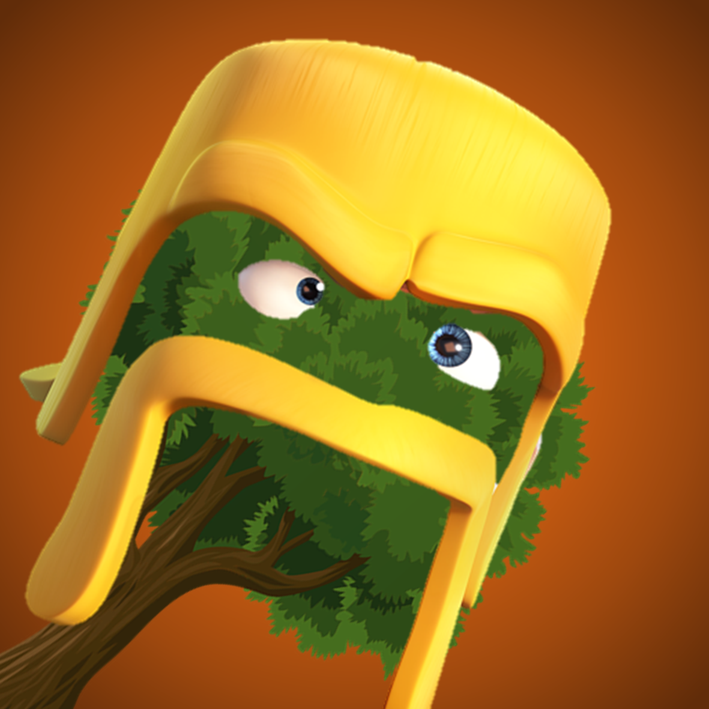

# Clash of Forest

## About
Clash of Forest (COF) is a gamified productivity management tool. It aims to help workers stay focused on their work by award users in-game 'coins' for using productive apps (via machine vision) and deducts points for doing the opposite.

## User Guide
On system startup/when work starts, launch the <insert backend>.py file. Then, go on with doing work. Your screen is monitored via a Tensorflow Lite neural network that determines if you are doing productive work or not. 

If you are doing something productive, you will get in-game coins. Use these to purchase four types of housing, each of which bigger, better, and more beautiful than the previous, to increase the population of your 'city', which is the game part of this application. The more population you have, the better! (you can compare these in the Leaderboard and challenge your friends to see who can have a higher population!)

However, if you are not productive, you will lose your in-game coins. When your in-game coins drop below zero, bad things happen to your city? What exactly happens is a mystery - for us to know and you to find out!

## Installation
1. Install dependencies
   1. Install JDK >=17 and Python 3.9
   2. Install python dependencies 

           pip install -r requirements.txt
   3. Unzip the TensorFlow Model using 7zip (un7z model.7z.001, the rest will follow)

2. Run files
   1. Python Backend (run when starting work)
   
            python src/main.py

   2. Java Frontend (when checking city)

            java -jar COF.jar
      Note: There may be some scaling issues in Windows. For greater compatibility, please set your window scale to 125% or smaller in your settings.

## Work Distribution Matrix

| Ming Hong | Yue Heng |
| --------- | -------- |
| Java Game | Python Backend |
| JavaFX Components | Neural Network Training |
| Research and Ideation | Slides |